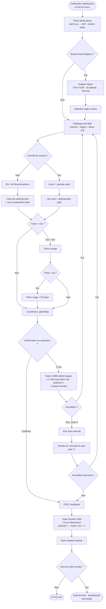
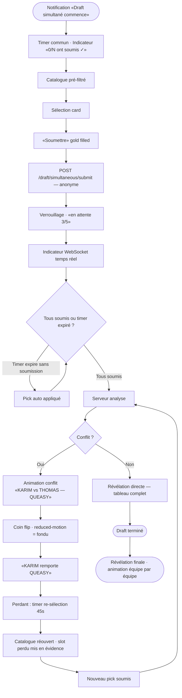
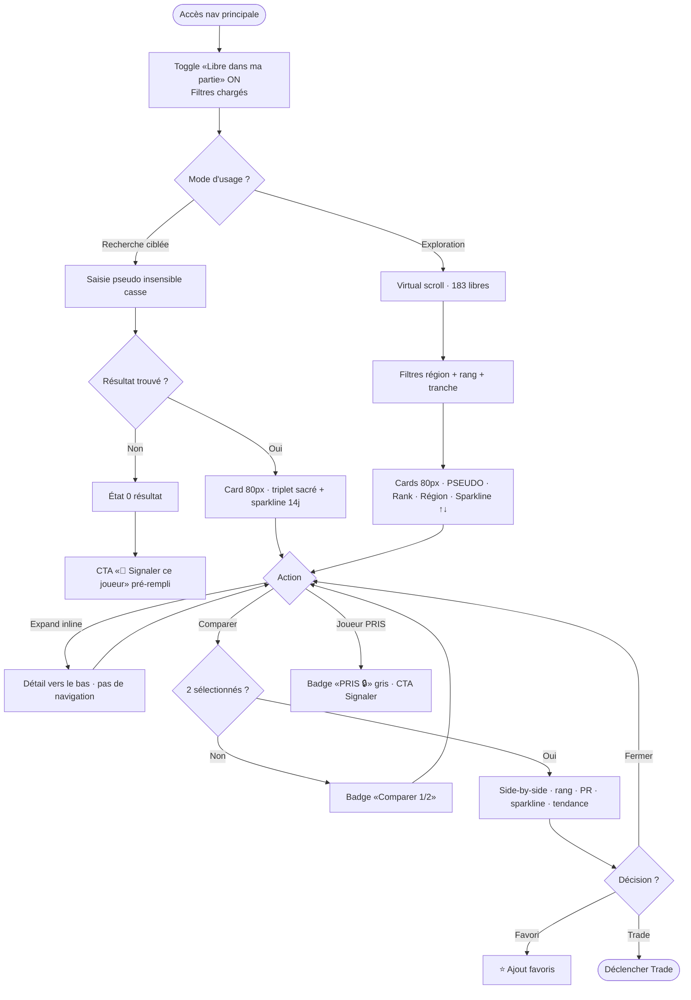
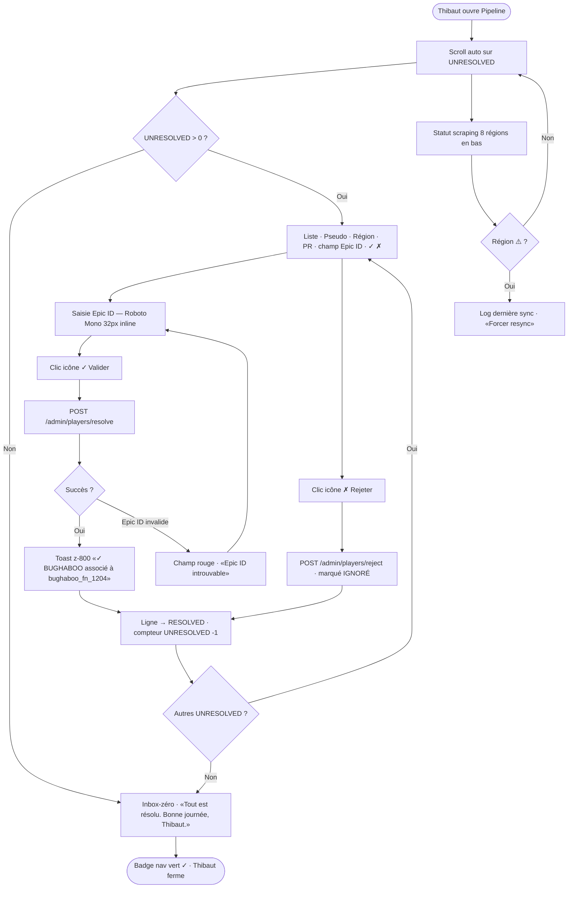

# UX Design Specification — FortniteProject

**Author:** Thibaut
**Date:** 2026-02-22

---

## Executive Summary

### Project Vision

FortniteProject est la première plateforme fantasy sports dédiée à l'esport Fortnite.
Elle transforme un Excel artisanal entre amis en une expérience fluide, immersive et
automatisée, centrée sur le moment émotionnel du draft et la rétention via le suivi
quotidien des Power Rankings.

### Target Users

| Profil | Description | Besoin UX clé |
|---|---|---|
| Lucas (casual) | Invité par un ami, découvre l'esport | Onboarding guidé, vue pré-filtrée par slot |
| Thomas (novice) | Ne connaît aucun joueur pro | "Recommander" CTA gold + feedback narratif post-action |
| Karim (passionné) | Stratège, swap/trade actif | Catalogue dual-mode, comparaison side-by-side |
| Thibaut (admin) | Gestion pipeline & données | Inbox zéro UNRESOLVED, résolution inline |

### Key Design Challenges

1. **Timer draft serpent** — widget flottant persistant même en overlay catalogue,
   alerte overlay 10s avant expiration avec preview du pick auto, fenêtre d'annulation
   5s post-expiration, phase warm-up avant la pression du tour actif, timer numérique
   en grand (pas une barre)

2. **Animation draft simultané** — indicateur anonyme "N/5 ont soumis ✓" pendant
   l'attente, théâtralisation face-à-face du conflit (nommer les deux participants),
   message explicite sur slots conservés, timer de re-sélection affiché

3. **Catalogue dual-mode** —
   - Mode Draft : pré-filtré par tranche/région/disponibilité, vue cartes validées
     pour ce slot, virtual scroll obligatoire, recherche insensible casse/accents
   - Mode Veille : toggle "Libre dans ma partie" par défaut, badge joueurs pris,
     comparaison side-by-side, état "0 résultat" avec CTA "Signaler ce joueur"

4. **Pipeline admin inbox-zéro** — UNRESOLVED en section prioritaire haute (badge rouge),
   résolution inline (champ Epic ID + Valider dans la ligne), statut 8 régions en
   couleur compacte en bas, score de confiance par résolution auto

### Design Opportunities

1. Draft comme pic émotionnel : vue pré-filtrée par slot, countdown numérique en grand,
   barre d'ordre serpent avec avatars des participants
2. "Recommander" = CTA gold, même poids visuel que "Confirmer", avec micro-explication
   du choix proposé ("Meilleur joueur EU disponible à ce slot — rank 3")
3. Révélation simultanée théâtralisée : coin flip visible, upgradeable en collectif
   WebSocket (Growth)
4. Pipeline admin = satisfaction "✓ Tout résolu" quand inbox est vide

### New Draft Variant — MVP

**Serpent Multi-Régions** — N serpents indépendants en parallèle (un par région
configurée dans la partie), tirage aléatoire séparé par région, timer commun partagé.
Si un participant est actif dans plusieurs serpents simultanément, il les traite
séquentiellement dans le même timer. Interface : onglets région avec états
"TON TOUR / En attente de X / Terminé ✓".

⚠️ Impact architectural : table `DRAFTS` doit supporter des curseurs de pick par région
(pas scalaire unique `current_pick`). À intégrer dans Flyway V12 et DraftPickOrchestrator.

### Key Decisions from Elicitation

| Décision | Statut | Source |
|---|---|---|
| Timer configurable par le créateur (30s/60s/90s/24h) | ✅ MVP | What If #1 |
| Vue pré-filtrée par slot (pas catalogue brut) | ✅ MVP | First Principles |
| Catalogue dual-mode (Draft vs Veille) | ✅ MVP | First Principles |
| Serpent Multi-Régions | ✅ MVP | Thibaut |
| Révélation collective WebSocket | ⏳ Growth | Party Mode |
| Score confiance résolution auto pipeline | ✅ MVP | What If #5 |
| "N/5 ont soumis" (anonyme) | ✅ MVP | Party Mode |
| Fenêtre annulation pick auto (5s) | ✅ MVP | Customer Support Theater |
| Bouton Signaler pré-rempli sur "0 résultat" | ✅ MVP | Customer Support Theater |

---

## Core User Experience

### Defining Experience

L'action centrale = le pick de draft. Choisir un joueur pro dans une fenêtre temporelle,
avec les bonnes données sous les yeux. Tout le reste (catalogue, leaderboard, swap, trade)
sert ce moment ou sa rétention post-draft.

> *Si on perfectionne le pick de draft, tout le reste suit.*

### Platform Strategy

| Dimension | Décision |
|---|---|
| Plateforme principale | Web desktop — navigateur moderne (Chrome/Firefox/Safari/Edge) |
| Input | Souris + clavier — pas touch-first |
| Mobile | Nice-to-have — responsive si naturel, pas de contrainte forte |
| Offline | Non requis — app connectée permanente |
| PWA/install | Non requis MVP |

### Effortless Interactions

| Interaction | Pourquoi ça doit être invisible |
|---|---|
| Rejoindre via lien | Premier contact Lucas/Thomas — friction = abandon immédiat |
| Comprendre son tour | Timer crée déjà la pression — l'interface ne peut pas en ajouter |
| Trouver le bon joueur | Thomas : 1 clic ("Recommander") · Karim : 3 filtres max |
| Confirmer un pick sans doute | Feedback immédiat obligatoire — "Mon pick est enregistré ?" |
| Résoudre un UNRESOLVED | Thibaut à 6h du matin — zéro navigation, 1 action |

### Critical Success Moments

| Moment | Conséquence si raté |
|---|---|
| Premier draft de Lucas | Ne comprend pas les tranches → abandonne, ne revient plus |
| Pick auto sans warning | Timer expiré → sentiment de trahison par l'app |
| Révélation conflit simultané | Animation incomprise → Thomas pense que son compte bug |
| Swap rejeté sans explication | Karim frustré → perte de confiance durable |
| Catalogue "0 résultat" | Pas de CTA → utilisateur croit que le joueur n'existe pas |
| Dashboard UNRESOLVED introuvable | Thibaut ouvre la DB directement |

### Experience Principles

1. **Draft = décision guidée, pas recherche** — l'interface présente les candidats valides
   pour le contexte actuel. Catalogue complet = profondeur, pas surface.
2. **Chaque action = feedback immédiat et narratif** — pas de doute possible. Chaque pick,
   soumission, swap ou résolution reçoit un message qui nomme ce qui s'est passé.
3. **Timer visible partout, toujours** — le countdown ne disparaît jamais quelle que soit
   la vue ouverte.
4. **Admin = inbox, pas dashboard** — la page pipeline s'ouvre sur les UNRESOLVED.
   Succès = liste vide.
5. **Conflit = événement légitime théâtralisé** — l'aléatoire est rendu visible pour
   être perçu comme juste.

---

## Desired Emotional Response

### Primary Emotional Goals

| Profil | Émotion cible | Émotion à éviter |
|---|---|---|
| Lucas | Sécurité ("je ne peux pas me planter") | Anxiété sociale, honte publique |
| Thomas | Sentiment de temps gérable | Panique, exclusion |
| Karim | Validation d'expertise + jalousie constructive | Injustice, impuissance |
| Thibaut | Tranquillité mentale (silence cognitif) | Frustration, surcharge |

### Emotional Journey Mapping

- Découverte → Appartenance (vestiaire pré-draft, avatars, emojis)
- Tour draft → Sécurité guidée (novice) / Adrénaline contrôlée (expert)
- Révélation simultanée → fin du draft complet uniquement, animation lente équipe
  par équipe → Suspense maximum → Soulagement ou rebond légitime
- Post-draft quotidien → Fierté par procuration différée
- Jalousie constructive (picks adverses visibles) → Action (swap, trade)
- Pipeline admin → Tranquillité mentale (silence si tout va bien)

### Micro-Emotions

- Sécurité : warm-up, "Recommander" rassurant, pas d'erreur catastrophique possible
- Légitimité : conflit nommé, animation coin flip physique, aléatoire transparent
- Appartenance : vestiaire pré-draft avec avatars + emojis avant la compétition
- Jalousie constructive : picks adverses visibles post-révélation finale
- Validation d'expertise : copy "tu as sélectionné X" + highlight narratif contextuel
- Tranquillité : badge vert discret quand pipeline OK, silence si rien à faire

### Emotions to Avoid

Trahison · Exclusion · Injustice · Impuissance · Doute · Honte publique

### Design Implications

| Émotion cible | Décision UX / copy |
|---|---|
| Sécurité novice | Warm-up + "Recommander" rassurant + feedback narratif |
| Adrénaline expert | Timer rouge <15s, mode hardcore configurable |
| Jalousie constructive | Picks adverses visibles post-révélation finale complète |
| Fierté par procuration | Notif push "ton joueur vient de scorer" (Growth) |
| Flèche tendance | Indicateur ↑↓ hebdo sur leaderboard (MVP) |
| Appartenance | Vestiaire pré-draft avec avatars + emojis |
| Tranquillité admin | Silence sur inbox vide · Toast actif sur résolution réussie |
| Légitimité conflit | Animation coin flip physique + noms des deux participants |
| Copy picks | "Tu as sélectionné X" (appropriation active, naturel) |
| Révélation simultanée | Fin du draft complet, animation lente progressive équipe par équipe |

### Emotional Design Principles

1. **Encoder la validation d'expertise** — copy d'un fan qui valide sa connaissance esport.
2. **Deux registres selon le profil** — rassurant pour les novices, intense pour les experts.
   Intensité configurable par le créateur de partie.
3. **La jalousie est un moteur, pas un bug** — picks adverses visibles pour déclencher
   l'action (swap, trade) et la rétention.
4. **Le silence est une émotion admin** — Satisfaction = toast actif. Tranquillité = silence.
5. **Lier le réel au jeu explicitement** — performances esport réelles → fierté par procuration.

---

## UX Pattern Analysis & Inspiration

### Platform Decision

**50/50 desktop/mobile** — responsive obligatoire, même qualité sur les deux plateformes.
Pas mobile-first, pas desktop-first. Touch interactions + souris/clavier également supportés.

### Inspiring Products Analysis

| App | Score pondéré | Force principale | Application FortniteProject |
|---|---|---|---|
| **Kahoot** | 53 | Timer + onboarding + collectif | Draft serpent, révélation, classement vivant |
| **Trade Republic** | 58 ↑ | Données riches + UX simple | Leaderboard delta PR, pipeline admin |
| **Sofascore** | ~55 ↑ | Analytics sportives profondes | Profil joueur, sparkline rang |
| **Finary** | 53 ↑ | Synthèse patrimoine | Dashboard leaderboard synthétique |
| **Tinder** | 45 | Card unique + décision binaire | Vue pick pré-filtrée slot par slot |
| **Discord** | 42 | Social épuré + présence | Vestiaire pré-draft, notifications |
| **Instagram/TikTok** | 42 | Scroll fluide infini | Virtual scroll catalogue |

**Principe fondamental : "Puissant mais progressif"**
Simple ≠ limité. La surface appartient à Thomas, la profondeur appartient à Karim.
Progressive disclosure — même écran, deux niveaux de densité naturels.

**Triplet sacré (minimum non-négociable sur chaque card joueur) :**
rang + région + tendance (sparkline sur rang, pas PR absolu)

### Sparkline — Définition technique

- Affiche l'évolution du **rang** sur 30 derniers jours (pas les points PR absolus)
- Le rang peut monter et descendre (si d'autres progressent plus vite)
- Calculé depuis `PR_SNAPSHOTS` (snapshot_date, rank par région)
- Affiché uniquement si ≥ 2 snapshots disponibles — sinon masqué silencieusement
- **Mode draft timer** : sparkline masqué (minimal : nom + rang + région)
- **Mode catalogue/browse** : sparkline affiché

### Transferable UX Patterns

| Pattern | Source | Application |
|---|---|---|
| Une décision à la fois | Tinder + Kahoot | Vue pré-filtrée par slot (20 candidats max) |
| Sélection contextuelle | SCAMPER S | Catalogue filtré auto par tranche + région + dispo |
| Card hover/clic/confirm | Desktop UX | Hover=preview · Clic=select · Entrée/bouton=confirm |
| Swipe ou tap | Mobile UX | Touch = tap card pour sélectionner |
| Couleur = émotion | Trade Republic | Vert/rouge sur tendances PR, timer, statut pipeline |
| Sparkline rang | Sofascore | Mini-courbe 30j sur card hors draft |
| Badge "📈 En hausse" | SCAMPER M | Joueurs dont rang a progressé significativement |
| Catalogue expand inline | SCAMPER E | Pas de navigation — expand vers le bas |
| Ticker leaderboard | Twitch × App | Delta PR animé, positions remontent/descendent |
| Widget tendances semaine | SCAMPER R | "Joueurs qui montent cette semaine" (Growth) |

### Genre Mashup — Patterns hybrides retenus

| Mashup | Pattern hybride | Priorité |
|---|---|---|
| Kahoot × Sofascore | Card révélation = émotionnel + données simultanément | ✅ MVP |
| Tinder × Trade Republic | Card pick = swipeable/tappable avec sparkline | ✅ MVP |
| Twitch × App perso | Leaderboard ticker + notif "breaking news esport" | ✅ MVP |
| Discord × Chess.com | Vestiaire pré-draft avec historique adversaires | ⏳ Growth |
| Duolingo × Fantasy | Streak suivi quotidien (sans gamification forcée) | ⏳ Growth |

### Anti-Patterns to Avoid

| Anti-pattern | Raison |
|---|---|
| Menus multi-niveaux | Thibaut à 6h = 2 clics max vers l'action |
| Écrans chargés (Bloomberg) | Lucas/Thomas abandonnent — triplet sacré suffit en surface |
| Formulaires longs à l'onboarding | Code + clic = rejoindre. Rien de plus |
| Notifications de masse | 1 alerte = 1 action requise uniquement |
| Stats complètes pendant le timer | Mode draft = minimal, pas le moment d'analyser |
| Copier DraftKings | Complexité sans modèle financier = bruit pur |

### Design Inspiration Strategy — Adopter / Adapter / Éviter

**Adopter :** Kahoot (timer collectif) · Tinder (card unique) · Trade Republic (vert/rouge/tendance) · Sofascore (sparkline rang) · Discord (épuré + présence sociale)

**Adapter :** Finary (synthèse patrimoine → leaderboard) · Twitch (broadcast → ticker personnel) · Discord (social → vestiaire privé entre amis)

**Éviter :** DraftKings (complexité casino) · FPL (UX vieillissante, trop d'onglets)

### Garde-fous UX — Anti-dette de complexité

| Garde-fou | Règle | Quand appliquer |
|---|---|---|
| Règle des 3 actions max | Chaque écran = max 3 actions en surface | Chaque nouvelle feature |
| Gate MVP/Growth contractuel | Aucune feature Growth avant tous les tickets MVP verts | Avant chaque sprint |
| Triplet sacré | Card joueur = max 4 éléments visibles simultanément | Design component |
| Taxonomie notifications | Push=urgent · In-app=utile · Opt-in=informatif | Avant toute nouvelle notif |
| Inbox invariant pipeline | Page pipeline s'ouvre toujours sur UNRESOLVED | Chaque extension admin |

---

## Design System Foundation

### Design System Choice

**Angular Material ^20.0.3** — déjà en production, non négociable.
Approche : Themeable System avec couche gaming custom sur Material.

### Rationale

- Stack existante — refactoring serait une régression pure
- Material = accessibilité WCAG intégrée, critique pour 50/50 desktop/mobile
- Thème dark + gold déjà établi et cohérent (JIRA-UX-001)
- Chart.js + ng2-charts déjà présents pour les sparklines rang

### Customization Strategy

- SCSS mixins gaming existants (`@import '../../shared/styles/mixins'`) étendus
- Nouveaux composants standalone Angular 19+ avec `inject()` pattern
- Design tokens : gold `#F5A623`, dark background, rouge timer `#E53935`

### New Components Required

| Composant | Usage | Mode |
|---|---|---|
| `PlayerCardComponent` | Card joueur draft + catalogue | `draft` / `browse` |
| `SparklineChartComponent` | Mini-courbe rang 30j | Browse uniquement |
| `DraftTimerComponent` | Countdown + warm-up + alerte 10s | Draft uniquement |
| `SnakeOrderBarComponent` | Barre ordre participants + curseur actif | Draft serpent |
| `CoinFlipAnimationComponent` | Révélation conflit simultané | Draft simultané |
| `LeaderboardTickerComponent` | Delta PR animé, positions remontent | Leaderboard |
| `PipelineInboxComponent` | File UNRESOLVED + résolution inline | Admin pipeline |

---

## Core Interaction Design

### 2.1 Defining Experience

> **"Drafter des joueurs pros Fortnite, voir leur vrai PR impacter ton classement entre amis."**

FortniteProject : L'experience centrale = choisir un joueur pro dans une fenêtre temporelle
contrainte, avec les bonnes données sous les yeux, et sentir que ce choix compte vraiment.

Comme **Spotify** — "découvre et joue n'importe quelle chanson instantanément" —
notre version : "choisis un pro, vis son ascension ou sa chute dans ta ligue."

Ce moment — le pick — est la raison d'être de tout le reste. Le catalogue sert ce moment.
Le leaderboard rend ce moment concret. Le pipeline admin permet ce moment d'exister.
Si on perfectionne le pick de draft, tout le reste suit.

**L'expérience que les utilisateurs décriront à leurs amis :**
> "Tu as 60 secondes pour choisir ton joueur EU — tu vois son rang, sa tendance sur 30 jours,
> et si tu attends trop longtemps, l'app choisit pour toi."

### 2.2 User Mental Model

**Transition mentale : Excel artisanal → app fluide**

| Mental model actuel (Excel) | Mental model cible (app) |
|---|---|
| Chercher un joueur dans un fichier plat | Vue pré-filtrée : les 20 bons candidats pour ton slot |
| "Qui est disponible ?" = recopie manuelle | Badge "Libre" automatique en temps réel |
| Résultat connu seulement après la partie | Sparkline rang = signal continu de performance |
| Timer = pression d'un ami qui t'attend | Timer = widget flottant, toujours visible |
| Conflit de pick = arbitrage humain | Animation coin flip = aléatoire transparent et légitime |

**Attentes implicites de l'utilisateur :**
- Thomas (novice) : "Une app m'aide à ne pas me planter" — il attend un CTA "Recommander"
- Karim (expert) : "Je veux accéder aux mêmes infos que les pros" — sparkline, stats, filtres région
- Lucas (casual) : "Je veux juste participer sans comprendre toute la mécanique"
- Thibaut (admin) : "Je veux ouvrir et fermer la page en 30 secondes"

**Points de friction anticipés :**
- Concept de "tranche" = inconnu pour un novice → éducation inline au premier draft uniquement
- "Simultané = tout le monde choisit en même temps ?" → explication textuelle simple à l'initiation
- "Serpent Multi-Régions = je dois choisir pour chaque région ?" → onglets clairs + état par région
- "Mon pick a bien été enregistré ?" → feedback immédiat et narratif obligatoire

### 2.3 Success Criteria

**L'interaction de pick est réussie quand :**

| Critère | Indicateur mesurable |
|---|---|
| L'utilisateur sait que c'est son tour | Badge "🟢 TON TOUR" visible en < 2s après notification |
| Il trouve le bon joueur | < 3 clics pour atteindre le pick confirmé (novice avec "Recommander") |
| Il confirme sans doute | Toast "Tu as sélectionné [Nom] — [Rang] EU ✓" affiché immédiatement |
| Il comprend le résultat du conflit simultané | Animation nommée visible, message explicatif lisible |
| Timer ne trahit pas | Overlay ⚠️ à T-10s + fenêtre annulation 5s post-expiration |
| Admin résout en 1 action | Champ Epic ID inline + Valider dans la même ligne UNRESOLVED |

**Feedback qui dit "c'est en train de fonctionner" :**
- Le timer numérique diminue visiblement (pas de barre, un nombre en grand)
- La carte du joueur sélectionné passe à l'état "sélectionné" (highlight gold)
- Le toast est narratif : pas "Pick confirmé" mais "Tu as sélectionné Arkadii — Rank 3 EU ✓"
- La barre d'ordre serpent avance vers le prochain participant

### 2.4 Novel UX Patterns

**Patterns établis utilisés :**

| Pattern | Usage | Référence |
|---|---|---|
| Card unique + décision binaire | Vue draft pré-filtrée slot par slot | Tinder |
| Timer collectif visible | Countdown numérique partagé | Kahoot |
| Couleur = signal d'action | Vert/rouge sur tendances et timer | Trade Republic |
| Sparkline mini | Évolution rang 30j | Sofascore |
| Inbox zéro | Pipeline UNRESOLVED prioritaire | Email / Linear |

**Patterns nouveaux nécessitant une éducation inline :**

| Pattern novel | Raison de la nouveauté | Education prévue |
|---|---|---|
| Tranches de draft | Concept esport non-universel | Tooltip au survol "Qu'est-ce qu'une tranche ?" au 1er draft |
| Draft simultané (soumission + révélation différée) | Inédit sur ce type de plateforme | Écran d'initiation "Comment fonctionne le draft simultané ?" |
| Serpent Multi-Régions (N serpents parallèles) | Mécanique originale | Onglets région avec état + bulle aide contextuelle |
| Conflit = coin flip animé | Métaphore physique digitale | Label "En cas d'égalité, tirage au sort aléatoire" visible avant le draft |
| Révélation finale collective (pas round par round) | Contre-intuitif vs fantasy classique | Bandeau "Les picks seront révélés à la fin du draft complet" |

**Innovation UX clé — Sparkline sur RANG (pas PR absolu) :**
Le PR absolu ne fait que monter — une sparkline plate serait sans sens.
Le rang fluctue à mesure que la compétition progresse — c'est ce qui crée la tension visuelle.

### 2.5 Experience Mechanics

#### Flow A — Draft Serpent (avec timer)

**1. Initiation**
- Notification WebSocket : "C'est ton tour dans [Région]"
- Timer flottant passe de "warm-up" (gris) à "actif" (blanc → orange → rouge selon le temps restant)
- Vue catalogue filtrée auto sur tranche + région + joueurs disponibles (≤ 20 candidats)
- Badge "🟢 TON TOUR — [Région]" affiché en haut de la vue draft

**2. Interaction**
- Desktop : hover sur card = preview stats expandées, clic = card sélectionnée (highlight gold),
  Entrée ou bouton "Confirmer" = pick enregistré
- Mobile : tap card = sélectionnée, bouton "Confirmer" dans zone pouce (bottom 40% écran)
- "Recommander" (CTA gold) = pré-sélectionne le meilleur joueur disponible pour ce slot
  avec micro-explication inline : "Meilleur joueur EU disponible — Rank 3"
- Timer T-10s : overlay flottant "⚠️ Pick auto dans 10s : [Nom] Rank [N] — [Annuler]"
  avec bouton d'annulation bien visible
- Timer expiré : pick auto exécuté, fenêtre 5s "Annuler le pick auto" encore disponible

**3. Feedback**
- Toast narratif : "Tu as sélectionné Arkadii — Rank 3 EU ✓" (disparaît après 3s)
- Barre d'ordre serpent : curseur avance vers prochain participant (animé)
- Card joueur passe en état "Déjà pris" dans le catalogue des autres
- Si Serpent Multi-Régions : onglet région passe à "✓ Terminé" et onglet suivant s'active

**4. Completion**
- Barre serpent : tous les slots cochés → écran "Draft terminé"
- Si révélation collective (Growth) : animation progressive équipe par équipe
- Si MVP : picks adverses visibles immédiatement post-draft, vue leaderboard préchargée

---

#### Flow B — Draft Simultané

**1. Initiation**
- Notification "Le draft simultané commence — vous avez [Timer] pour soumettre votre pick"
- Chaque participant voit son propre slot à remplir, sans voir les choix des autres
- Indicateur anonyme : "0/5 ont soumis ✓" mis à jour en temps réel

**2. Interaction**
- Même mécanique de sélection card que le Draft Serpent
- Confirmation = soumission anonyme : "Tu as soumis ton pick — en attente des autres (3/5)"
- Impossible de changer après soumission (verrouillage immédiat avec message explicatif)

**3. Feedback — Résolution conflit**
- Quand N/5 ont soumis : animation de révélation
- Si pas de conflit : résultat direct "Tous les picks sont uniques ✓"
- Si conflit : animation coin flip avec noms explicites "Karim vs Thomas → [Nom] remporte ce slot"
  → perdant voit "Slot perdu — tu as [Timer]s pour re-sélectionner" avec slot disponible mis en évidence

**4. Completion**
- Récapitulatif post-draft : tableau complet de tous les picks (toutes équipes)
- Message d'équipe propre : "Ton équipe : [Joueur 1] · [Joueur 2] · [Joueur 3]..."

---

#### Flow C — Catalogue Joueurs (mode veille)

**1. Initiation** : Accès depuis nav principale, toggle "Libre dans ma partie" activé par défaut

**2. Interaction** : Filtres permanents (région, rang min/max, tranche), recherche pseudo
insensible casse/accents, virtual scroll natif (1000+ joueurs sans pagination), expand
inline sur la card (pas de navigation vers autre page)

**3. Feedback** : Badge "Déjà pris" sur joueurs pris, "0 résultat → Signaler ce joueur"
CTA pré-rempli, comparaison side-by-side jusqu'à 2 joueurs simultanément

**4. Completion** : Ajouter en favoris, partager un joueur, ou déclencher un trade

---

#### Flow D — Pipeline Admin

**1. Initiation** : Page s'ouvre systématiquement sur section UNRESOLVED (scroll auto)

**2. Interaction** : Résolution inline = champ Epic ID dans la ligne + bouton "Valider"
(pas de navigation vers un écran séparé). Statut 8 régions visible en bas en couleur compacte.

**3. Feedback** : Résolution réussie → toast actif "✓ [Pseudo] associé à [EpicID]".
Pipeline vide → silence (pas de badge, pas de notification = tranquillité mentale).

**4. Completion** : Badge rouge dans nav disparaît quand UNRESOLVED = 0. Thibaut ferme l'onglet.

---

## Visual Design Foundation

### Color System

**Stratégie : Dark Gaming Theme — gold sémantiquement divisé, couleur + forme obligatoire**

| Token | Valeur | Tier | Usage |
|---|---|---|---|
| `--color-action` | `#F5A623` gold chaud | MVP | CTA boutons ("Confirmer" filled, "Recommander" ghost) |
| `--color-achievement` | `#FFD700` gold pur | MVP | Rangs, accomplissements, badges performance |
| `--color-surface` | `#1A1A2E` dark navy | MVP | Background principal |
| `--color-surface-raised` | `#16213E` | MVP | Cards, modals (mat-elevation-z2) |
| `--color-surface-admin` | `#0D0D1A` | MVP | Fond pipeline admin — contexte opérateur |
| `--color-timer-active` | `#FFFFFF` | MVP | Timer 60s → 15s |
| `--color-timer-warning` | `#FF9800` orange | MVP | Timer 15s → 5s (transition CSS continue via @property) |
| `--color-timer-urgent` | `#E53935` rouge | MVP | Timer < 5s — toujours accompagné de ⏱️ |
| `--color-success` | `#4CAF50` vert | MVP | Pick confirmé, résolution pipeline |
| `--color-pipeline-ok` | `#4CAF50` | MVP | Icône ✓ 8px dans nav admin (signal santé silencieux) |
| `--color-trend-up` | `#4CAF50` | MVP | Sparkline hausse — toujours avec ↑ |
| `--color-trend-down` | `#E53935` | MVP | Sparkline baisse — toujours avec ↓ |
| `--color-taken` | `#616161` gris | MVP | Token universel inactif/indisponible |
| `--color-text-primary` | `#FFFFFF` | MVP | Textes principaux |
| `--color-text-secondary` | `#B0BEC5` | MVP | Textes secondaires, labels |

**Règles absolues :**
- Couleur seule = interdit pour signaux critiques → couleur + icône/forme obligatoire (WCAG 1.4.1)
- 0 couleur hardcodée dans les composants — tout via tokens CSS (Growth-ready light theme)
- `mat-elevation-z2/z4` pour la hiérarchie d'élévation (pas de 3e couleur de surface)
- `--color-surface-elevated` supprimé (redondant avec Material elevation)
- `--color-text-muted` supprimé (redondant avec `--color-text-secondary`)

**Contexte admin :**
`mat-toolbar` slim 32px "MODE ADMINISTRATION" en haut de toutes les pages admin,
fond `#0D0D1A`, texte `--color-text-secondary` discret. Signal contextuel fort, coût nul.

**Z-Index scale (documenté explicitement) :**

```
100  — navigation sticky
200  — timer sticky
500  — modals catalogue
800  — toasts standard
9000 — toast pick auto (critique, z-index max overlays)
9999 — reserved (system alerts)
```

### Typography System

**Base : Rajdhani (gaming, titres) + Roboto (corps) — tabular-nums sur tous les chiffres**

| Niveau | Police | Taille | Poids | Tier | Usage |
|---|---|---|---|---|---|
| `display-lg` | Rajdhani | 48px | 700 | MVP | Titre draft, révélation conflit |
| `display-md` | Rajdhani | 32px | 700 | MVP | Timer numérique principal |
| `heading-lg` | Rajdhani | 24px | 600 | MVP | Nom joueur dans toast |
| `heading-md` | Roboto | 18px | 600 | MVP | Sous-titres sections, labels pipeline |
| `body-lg` | Roboto | 16px | 400/700 | MVP | Texte courant · Rang (bold, même mode minimal) |
| `body-md` | Roboto | 14px | 400 | MVP | Labels cards, filtres |
| `label-action` | Roboto | 14px | 700 | MVP | Boutons |
| `monospace` | Roboto Mono | 13px | 400 | MVP | Epic IDs dans pipeline admin |

**Règles typographiques :**
- Noms de joueurs pros = MAJUSCULES + `letter-spacing: 0.05em` (signature esport)
- Tous les chiffres rang/PR = `font-variant-numeric: tabular-nums` (colonnes alignées)
- Rang + flèche tendance = unité inséparable, même conteneur, même hiérarchie visuelle
- Rajdhani chargée via Google Fonts avec `font-display: swap` + `preconnect` (prévient FOUT pendant draft)

**Hiérarchie boutons (non-ambiguë) :**
- "Confirmer" = gold filled (`--color-action` background)
- "Recommander" = gold ghost (outline `--color-action`, background transparent)

### Spacing & Layout Foundation

**Grille 8px · Timer sticky · Dual-mode cards**

| Token | Valeur | Usage |
|---|---|---|
| `space-xs` | 4px | Gap icône/texte, inset badge |
| `space-sm` | 8px | Padding interne card compact |
| `space-md` | 16px | Gap entre cards, padding section |
| `space-lg` | 24px | Marge entre sections |
| `space-xl` | 32px | Padding page principale |

**Layout page draft (desktop + mobile — même structure) :**
- Timer sticky top — hauteur fixe 80px, persiste au scroll
- Barre serpent intégrée dans zone timer (pas colonne séparée)
- Catalogue plein écran scrollable en dessous
- Barre serpent : ≤ 6 participants = avatars · > 6 = format textuel "Tour de X (3/8)"
- < 480px : barre serpent → "Tour de KARIM (3/8)" textuel uniquement

**Densité cards (dual-mode `PlayerCardComponent`) :**

| Mode | Hauteur | Contenu | Sparkline |
|---|---|---|---|
| `draft` | 48px | NOM + rang 16px bold + région | Masquée |
| `browse` | 80px | Triplet sacré + sparkline (si ≥ 2 snapshots) | Visible |
| `browse` < 480px | 80px | Triplet sacré | Masquée |

**Pipeline admin :**
- Tableau dense, lignes 48px fixe (pas d'expand vertical)
- Champ Epic ID = `input` 32px inline dans la ligne
- Bouton Valider = icône ✓ pour tenir en 48px
- Toggle "Masquer les joueurs pris" activé par défaut en mode draft

### Timer — Implémentation technique

```css
@property --timer-color {
  syntax: '<color>';
  inherits: false;
  initial-value: #ffffff;
}

/* Interpolation HSL correcte via @property (Chromium 85+, Firefox 128+) */
/* Évite le brun RGB au milieu de orange → rouge */

/* T-10s : pulse physique */
@keyframes timer-pulse {
  0%, 100% { transform: scale(1.0); }
  50%       { transform: scale(1.05); }
}
/* prefers-reduced-motion : désactiver le pulse, garder uniquement le changement de couleur */
```

### Sparkline — Règle finale

- N derniers snapshots disponibles — défaut **14 jours** (configurable admin, pas 30j arbitraire)
- Visible uniquement si ≥ 2 snapshots disponibles (masqué silencieusement sinon)
- Axe X = "depuis le dernier snapshot" (pas "30 jours")
- Toujours accompagnée de ↑↓ (couleur + forme — WCAG 1.4.1)

### Accessibility Considerations

**Cible WCAG 2.1 AA — principe couleur + forme systématique**

| Règle | Implémentation | Tier |
|---|---|---|
| Couleur + forme | ⏱️ timer urgent · ↑↓ sparkline · ✓ pipeline-ok · chiffre UNRESOLVED | MVP |
| Contraste 4.5:1 | `#F5A623` sur `#1A1A2E` = 5.2:1 ✓ | MVP |
| Focus visible | `focus-visible` outline gold 2px | MVP |
| Reduced motion | Timer pulse désactivé → fondu uniquement | MVP |
| Touch targets | 44×44px minimum mobile (bouton Confirmer zone pouce) | MVP |
| Keyboard nav | Tab order : filtres → cards → CTA Confirmer | MVP |
| Daltonisme | 0 signal couleur seule — toujours doublé forme/icône | MVP |
| Screen reader | `aria-label` timer ("60 secondes restantes") + sparkline | MVP |
| Light theme | Tokens CSS uniquement — 0 couleur hardcodée (Growth-ready) | Growth |

---

## Design Direction Mockups

### Direction choisie

**Direction unique — Material Dark Gaming** (non négociable, déjà en production).
Pas de variations explorées : la fondation visuelle est verrouillée par l'existant (JIRA-UX-001).
Les mockups ci-dessous documentent les layouts concrets des 4 flows nouveaux.

### Mockup 1 — Draft Serpent (Desktop 1280px)

```
┌─────────────────────────────────────────────────────────────────────────────┐
│  FortniteProject          [EU] [NA] [BR]              👤 Karim    🔔 2      │
├─────────────────────────────────────────────────────────────────────────────┤
│ TIMER STICKY (80px, z-index 200)                                             │
│  ┌──────────────────────────────────────────────────────────────────────┐   │
│  │  🟢 TON TOUR — EUROPE                 ⏱  0:47          Slot : AWP   │   │
│  │  ████████████████████████░░░░░░  KARIM  →  Thomas  →  Lucas  →  ... │   │
│  └──────────────────────────────────────────────────────────────────────┘   │
├─────────────────────────────────────────────────────────────────────────────┤
│ CATALOGUE — EUROPE · AWP · Disponibles (18)                    [🔍 Pseudo] │
│  Filtres actifs : [EU ×] [AWP ×] [Libres ×]    [Masquer pris ✓]            │
│                                                                              │
│  ┌──────────────────┐  ┌──────────────────┐  ┌──────────────────┐          │
│  │ ★ RECOMMANDER    │  │ ARKADII          │  │ PETERBOTTT       │          │
│  │ QUEASY           │  │ 🥇 RANK  3  EU  ↑│  │ 🥇 RANK  7  EU →│          │
│  │ 🥇 RANK  1  EU  ↑│  │ ╱‾╲╱             │  │ ▔▔╲╱‾            │          │
│  │ ╱‾╲╱‾╲           │  │  [Sélectionner]  │  │  [Sélectionner]  │          │
│  │  [Sélectionner]  │  └──────────────────┘  └──────────────────┘          │
│  └──────────────────┘                                                        │
│  ┌──────────────────┐  ┌──────────────────┐                                 │
│  │ BENJYFISHY       │  │ CENTED      PRIS │                                 │
│  │ 🥇 RANK  9  EU ↓│  │ 🥇 RANK 11  EU   │                                 │
│  │ ╲_╱‾             │  │ (gris #616161)   │                                 │
│  │  [Sélectionner]  │  └──────────────────┘                                 │
│  └──────────────────┘    virtual scroll ↓                                   │
├─────────────────────────────────────────────────────────────────────────────┤
│  ÉTAT sélectionné :                                                          │
│  ✦ QUEASY sélectionné — RANK 1 EU          [Annuler] [████ Confirmer ████] │
├─────────────────────────────────────────────────────────────────────────────┤
│  ÉTAT timer T-10s (toast z-index 9000, pleine largeur) :                    │
│  ⚠️  Pick auto dans 10s — QUEASY RANK 1 EU       [Annuler le pick auto]    │
└─────────────────────────────────────────────────────────────────────────────┘
```

### Mockup 2 — Draft Simultané (Desktop)

```
  PHASE 1 — Soumission anonyme
┌─────────────────────────────────────────────────────────────────────────────┐
│  TIMER STICKY                                                                │
│  🟡 DRAFT SIMULTANÉ — Soumets ton pick              ⏱  1:23   3/5 ont soumis│
├─────────────────────────────────────────────────────────────────────────────┤
│  [catalogue filtré identique Draft Serpent]                                 │
│  Post-soumission :                                                           │
│  ✓ Tu as soumis — en attente des autres (4/5). Modification impossible.    │
└─────────────────────────────────────────────────────────────────────────────┘

  PHASE 2A — Pas de conflit
┌─────────────────────────────────────────────────────────────────────────────┐
│  ✓ Tous les picks sont uniques !                                            │
│  KARIM  → QUEASY      RANK 1 EU  ✓                                         │
│  THOMAS → ARKADII     RANK 3 EU  ✓                                         │
│  LUCAS  → PETERBOTTT  RANK 7 EU  ✓                                         │
└─────────────────────────────────────────────────────────────────────────────┘

  PHASE 2B — Conflit (Karim et Thomas ont choisi QUEASY)
┌─────────────────────────────────────────────────────────────────────────────┐
│         ⚔️  CONFLIT — QUEASY                                                │
│    KARIM              vs              THOMAS                                │
│  ┌─────────┐      [ coin flip ]    ┌─────────┐                             │
│  │   🪙 ?  │      (animation)      │   🪙 ?  │                             │
│  └─────────┘                       └─────────┘                             │
│                ✓  KARIM remporte QUEASY                                     │
│  THOMAS — Slot perdu. 45s pour re-sélectionner.  [Re-sélectionner →]       │
└─────────────────────────────────────────────────────────────────────────────┘
```

### Mockup 3 — Catalogue Joueurs (Desktop, mode veille)

```
┌─────────────────────────────────────────────────────────────────────────────┐
│  FortniteProject    Accueil · Draft · Catalogue · Leaderboard    👤 Karim   │
├─────────────────────────────────────────────────────────────────────────────┤
│  CATALOGUE JOUEURS                                                           │
│  [🔍 Rechercher un pseudo...]          [Libre dans ma partie ✓]             │
│  Région : [EU ✓] [NA] [BR] [ME] [APAC] [OCE] [SA]                         │
│  Rang    : [1 ──────●──────────── 500]   Tranche : [Toutes ▾]              │
│  247 joueurs · Libres : 183                          [Comparer (0/2)]       │
├─────────────────────────────────────────────────────────────────────────────┤
│  ┌──────────────────────────┐  ┌──────────────────────────┐                │
│  │ QUEASY              ↑   │  │ ARKADII              →   │                │
│  │ 🥇 RANK  1  EU  AWP     │  │ 🥇 RANK  3  EU  AWP      │                │
│  │ ╱‾╲╱‾╲╱ (sparkline 14j) │  │ ▔▔▔▔▔ (plat)             │                │
│  │  [+ Comparer] [⭐ Favori]│  │  [+ Comparer] [⭐ Favori] │                │
│  └──────────────────────────┘  └──────────────────────────┘                │
│  ┌──────────────────────────┐  ┌──────────────────────────┐                │
│  │ PETERBOTTT          ↓   │  │ CENTED         PRIS 🔒   │                │
│  │ 🥇 RANK  7  EU  BOX     │  │ 🥇 RANK  9  EU  BOX       │                │
│  │ ‾╲_╱                    │  │ (gris — déjà drafté)      │                │
│  │  [+ Comparer] [⭐ Favori]│  │  [Signaler ce joueur]     │                │
│  └──────────────────────────┘  └──────────────────────────┘                │
│  ↕ virtual scroll — 183 joueurs libres                                      │
├─────────────────────────────────────────────────────────────────────────────┤
│  ÉTAT "0 résultat" :                                                         │
│  Aucun joueur trouvé pour "bughaboo" en EU.                                 │
│  Ce joueur n'est peut-être pas encore dans notre base.                      │
│                              [📣 Signaler ce joueur →]                      │
└─────────────────────────────────────────────────────────────────────────────┘
```

### Mockup 4 — Pipeline Admin (Desktop)

```
┌─────────────────────────────────────────────────────────────────────────────┐
│  ┌─────────────────────────────────────────────────────────────────────┐    │
│  │  MODE ADMINISTRATION                                           ✓ OK │    │  ← mat-toolbar 32px #0D0D1A
│  └─────────────────────────────────────────────────────────────────────┘    │
│  Dashboard · Joueurs · Pipeline · Logs                        👤 Thibaut    │
├─────────────────────────────────────────────────────────────────────────────┤
│  PIPELINE IDENTITÉS JOUEURS                                                  │
│                                                                              │
│  ⚠️  UNRESOLVED (3)                                                         │
│  ┌──────────────┬────────┬────────┬──────────────────────┬───────────┐      │
│  │ Pseudo       │ Région │ PR     │ Epic ID              │ Action    │      │
│  ├──────────────┼────────┼────────┼──────────────────────┼───────────┤      │
│  │ bughaboo     │ EU     │ 1 204  │ [__________________] │ [✓] [✗]  │      │
│  │ xd_buga      │ NA     │   891  │ [__________________] │ [✓] [✗]  │      │
│  │ ProPlayer99  │ BR     │   445  │ [__________________] │ [✓] [✗]  │      │
│  └──────────────┴────────┴────────┴──────────────────────┴───────────┘      │
│  (lignes 48px fixes · champ Epic ID 32px inline · Roboto Mono)              │
│                                                                              │
│  ✓  RESOLVED (142)                            [▸ Voir l'historique]        │
│  ┌──────────────┬────────────────────┬───────────┬─────────────────┐        │
│  │ QUEASY       │ queasy_fn_2847     │ ████ 94%  │ 2026-02-21      │        │
│  │ ARKADII      │ arkadii_pro_eu     │ ███░ 81%  │ 2026-02-20      │        │
│  └──────────────┴────────────────────┴───────────┴─────────────────┘        │
│                                                                              │
│  STATUT SCRAPING — 8 RÉGIONS                                                │
│  EU ✓  NA ✓  BR ✓  ME ✓  APAC ✓  OCE ✓  SA ⚠️  AS ✓                      │
│  SA : dernière sync il y a 3h                                               │
├─────────────────────────────────────────────────────────────────────────────┤
│  ÉTAT inbox-zéro :                                                           │
│  ✓  UNRESOLVED (0)  — Tout est résolu. Bonne journée, Thibaut.             │
└─────────────────────────────────────────────────────────────────────────────┘
```

### Mockup 5 — Mobile 375px (Draft Serpent)

```
┌───────────────────┐
│  FP    🔔  👤     │
├───────────────────┤
│ 🟢 TON TOUR — EU  │  ← timer sticky 80px
│  ⏱  0:47  Slot AWP│
│ KARIM→Tho→Luc...  │  ← format textuel (> 6 participants)
├───────────────────┤
│ [🔍 Pseudo...]    │
│ [EU×][AWP×][Lib×] │
├───────────────────┤
│ ★ QUEASY          │  ← card compact 48px
│ 🥇 RANK 1 EU  ↑  │  ← sparkline masquée < 480px
│ [Sélectionner]    │
├───────────────────┤
│ ARKADII           │
│ 🥇 RANK 3 EU  →  │
│ [Sélectionner]    │
├───────────────────┤
│    ↕ scroll       │
├───────────────────┤
│ [████ Confirmer █]│  ← zone pouce, 44px min
└───────────────────┘
```

### Design Rationale

| Décision layout | Raison |
|---|---|
| Timer sticky 80px (pas colonne) | Même structure desktop/mobile — 0 refactoring breakpoint |
| Catalogue plein écran scrollable | Virtual scroll natif, pas de pagination |
| Cards 48px draft / 80px browse | Densité adaptée au contexte temporel |
| Pipeline = tableau (pas cards) | Opérateur ≠ joueur — densité max, monospace pour Epic IDs |
| Toast pick auto pleine largeur z-9000 | Visible au-dessus de tous les overlays, impossible à manquer |
| Barre serpent intégrée dans timer | Une seule zone sticky, pas deux |

---

## User Journey Flows

### Journey 1 — Draft Serpent : Pick complet



### Journey 2 — Draft Simultané : Soumission + Conflit



### Journey 3 — Catalogue Joueurs : Navigation + Comparaison



### Journey 4 — Pipeline Admin : Résolution UNRESOLVED



### Journey Patterns

| Pattern | Flows concernés | Règle |
|---|---|---|
| **Feedback narratif immédiat** | Serpent · Simultané · Pipeline | Toast = nom entité + action + résultat |
| **État vide = message positif + CTA** | Catalogue 0 résultat · Pipeline inbox-zéro | Pas de silence — message contextualisé |
| **Verrouillage post-action** | Soumission simultanée · Résolution pipeline | Confirmé = verrouillé + état affiché |
| **Timer = urgence progressive** | Draft serpent · Re-sélection simultanée | white → orange → rouge + ⏱️ obligatoire |
| **Entry point direct** | Pipeline → UNRESOLVED · Catalogue → Libres | Ouverture sur le cas le plus fréquent |

### Flow Optimization Principles

1. **Étapes minimales** — pick serpent = 3 interactions max (sélection → confirmation → toast)
2. **Récupération inline** — Epic ID invalide : correction sur place, pas de navigation
3. **Feedback préventif** — overlay T-10s prévient avant l'expiration
4. **Pas de navigation inter-pages** — expand inline catalogue, résolution inline pipeline
5. **Mobile = zone pouce** — «Confirmer» en bas (bottom 40%), jamais en haut

---

## Component Strategy

### Design System Components (Angular Material ^20.0.3)

| Composant Material | Usage |
|---|---|
| `mat-button` / `mat-raised-button` | "Confirmer" filled · "Recommander" ghost · "Valider" icône |
| `mat-input` / `mat-form-field` | Champ Epic ID inline, recherche pseudo |
| `MatSnackBar` | Toasts narratifs (pick confirmé, résolution pipeline) |
| `mat-tab-group` | Onglets régions Draft Serpent Multi-Régions |
| `mat-table` | Pipeline UNRESOLVED + RESOLVED |
| `mat-toolbar` | Header admin "MODE ADMINISTRATION" 32px |
| `mat-chip` | Tags filtres actifs `[EU ×]` · statut scraping 8 régions |
| `mat-slide-toggle` | Toggle "Libre dans ma partie" · "Masquer joueurs pris" |
| `mat-tooltip` | Aide contextuelle ("Qu'est-ce qu'une tranche ?") |
| `mat-progress-bar` | Score de confiance pipeline RESOLVED |
| `MatDialog` | Hébergement CoinFlipAnimationComponent |
| `cdk-virtual-scroll-viewport` | Virtual scroll catalogue 1000+ joueurs |

### Custom Components

#### `PlayerCardComponent`

**Purpose :** Card joueur dual-mode (draft 48px / browse 80px).

```typescript
@Input() player: Player
@Input() mode: 'draft' | 'browse'
@Input() selected: boolean
@Input() taken: boolean
@Input() recommended: boolean
```

| État | Apparence |
|---|---|
| `default` | Nom MAJUSCULES · `letter-spacing: 0.05em` · rang 16px bold |
| `hover` | Border gold 1px |
| `selected` | Background `--color-action` 20% · border gold 2px |
| `taken` | Opacity 0.4 · `--color-taken` · CTA "Signaler" uniquement |
| `draft` | 48px · sparkline masquée |
| `browse` | 80px · sparkline visible si ≥ 2 snapshots |

Accessibilité : `role="button"` · `aria-selected` · `aria-label="QUEASY Rank 1 EU disponible"` · `Enter`/`Space` = sélection.

---

#### `SparklineChartComponent`

**Purpose :** Mini-courbe Chart.js évolution rang N derniers snapshots.

```typescript
@Input() snapshots: RankSnapshot[]   // { date, rank }[]
@Input() defaultDays: number = 14
```

- Masqué si `snapshots.length < 2` (silencieusement)
- Axe Y inversé (rang 1 = haut)
- Couleur + flèche ↑↓ (WCAG 1.4.1)
- `aria-label="Rang en hausse sur 14 jours"`
- Dépendance : `ng2-charts` (déjà présent)

---

#### `DraftTimerComponent`

**Purpose :** Countdown Rajdhani 32px avec états visuels progressifs et overlay T-10s.

```typescript
@Input() durationSeconds: number
@Input() warmup: boolean
@Input() autoPickPlayer: Player
@Output() expired = new EventEmitter<void>()
@Output() cancelled = new EventEmitter<void>()
```

| État | Condition | Style |
|---|---|---|
| `warmup` | Avant le tour | Gris `#546E7A` |
| `active` | > 15s | Blanc `#FFFFFF` |
| `warning` | ≤ 15s | Orange via `@property --timer-color` |
| `urgent` | ≤ 5s | Rouge + ⏱️ + pulse (désactivé si `prefers-reduced-motion`) |
| `auto-pick-overlay` | T-10s | Toast z-9000 pleine largeur |

`@property --timer-color { syntax: '<color>'; }` — interpolation HSL correcte.
`aria-live="assertive"` · `aria-label="47 secondes restantes"` (mis à jour/s).

---

#### `SnakeOrderBarComponent`

**Purpose :** Ordre serpent avec curseur actif animé.

```typescript
@Input() participants: Participant[]
@Input() currentIndex: number
@Input() regionLabel?: string
```

- ≤ 6 participants : avatars avec initiales
- \> 6 participants : "Tour de KARIM (3/8)" textuel
- < 480px : format textuel systématiquement
- `aria-label="Tour de KARIM, position 3 sur 8"`

---

#### `CoinFlipAnimationComponent`

**Purpose :** Théâtralisation conflit draft simultané.

```typescript
@Input() player1: string
@Input() player2: string
@Input() contestedPlayer: string
@Input() winner: string
```

Séquence : conflit affiché → pièces CSS `rotateY` → ralentissement → résultat → message perdant.
`prefers-reduced-motion` : fondu 0.3s.
Focus automatique sur "Re-sélectionner" après révélation.

---

#### `PlayerSearchFilterComponent`

**Purpose :** Recherche + filtres combinés catalogue et mode draft.

```typescript
@Input() mode: 'draft' | 'browse'
@Input() availableRegions: string[]
@Input() availableTranches: string[]
@Output() filterChanged = new EventEmitter<PlayerFilter>()
```

- Debounce 300ms · `normalize('NFD')` insensible accents
- Mode draft : région + tranche verrouillés sur slot actuel
- Toggles ON par défaut : "Libre dans ma partie" + "Masquer pris" (draft)
- `aria-live` sur compteur résultats

---

#### `AdminPipelineTableComponent`

**Purpose :** Tableau dense résolution inline UNRESOLVED.

```typescript
@Input() unresolvedEntries: PlayerIdentityEntry[]
@Input() resolvedEntries: PlayerIdentityEntry[]
@Output() resolved = new EventEmitter<{id: string, epicId: string}>()
@Output() rejected = new EventEmitter<{id: string}>()
```

- Lignes 48px fixes · champ Epic ID 32px Roboto Mono inline
- Boutons ✓/✗ icônes (tiennent en 48px)
- État error : champ rouge + message inline
- Section statut scraping : 8 `mat-chip` vert/orange ⚠️

### Implementation Roadmap

**Phase 1 — P0 · Critique MVP (bloquant pour les 4 flows)**

| Composant | Flow bloqué |
|---|---|
| `DraftTimerComponent` | Draft Serpent + Simultané |
| `PlayerCardComponent` | Draft Serpent + Catalogue |
| `PlayerSearchFilterComponent` | Draft Serpent + Catalogue |
| `AdminPipelineTableComponent` | Pipeline Admin |

**Phase 2 — P1 · Enrichissement MVP**

| Composant | Flow |
|---|---|
| `SnakeOrderBarComponent` | Draft Serpent |
| `CoinFlipAnimationComponent` | Draft Simultané |
| `SparklineChartComponent` | Catalogue + PlayerCard browse |

**Phase 3 — Growth**

| Composant | Flow |
|---|---|
| `LeaderboardTickerComponent` | Leaderboard live |
| `RevealAnimationComponent` | Révélation collective WebSocket |

---

## UX Consistency Patterns

### Button Hierarchy

**Règle d'or : max 2 actions primaires visibles simultanément.**

| Niveau | Style Material | Token | Usage | Exemple |
|---|---|---|---|---|
| **Primary** | `mat-raised-button` filled | `--color-action` bg | 1 seul par écran | "Confirmer le pick" |
| **Secondary** | `mat-stroked-button` ghost | `--color-action` border | Action réversible | "Recommander" |
| **Tertiary** | `mat-button` text | `--color-text-secondary` | Navigation, annulation | "Annuler" |
| **Danger** | `mat-raised-button` | `--color-timer-urgent` bg | Irréversible + destructif | "Rejeter ✗" |
| **Icon action** | `mat-icon-button` | `--color-action` | Action compacte tableau | "✓" "✗" |

**Règles FortniteProject :**
- "Recommander" = toujours ghost — jamais même poids que "Confirmer"
- "Confirmer" = toujours filled gold — jamais deux filled sur le même écran
- Tableau 48px = icônes uniquement (pas de texte)
- Mobile : bouton principal dans zone pouce (bottom 40% viewport)

### Feedback Patterns

**Principe : chaque action = feedback immédiat et narratif. Zéro ambiguïté.**

| Type | Composant | Z-index | Durée | Exemple |
|---|---|---|---|---|
| Succès pick | `MatSnackBar` | 800 | 3s auto | "Tu as sélectionné QUEASY — Rank 1 EU ✓" |
| Succès pipeline | `MatSnackBar` | 800 | 3s auto | "✓ BUGHABOO associé à bughaboo_fn_1204" |
| Urgence timer | Custom toast | 9000 | Manuel (bouton Annuler) | "⚠️ Pick auto dans 10s : QUEASY" |
| Erreur validation | Inline sous champ | — | Persiste jusqu'à correction | "Epic ID introuvable" |
| Erreur réseau | `MatSnackBar` | 800 | 5s + Réessayer | "Connexion perdue — Réessayer" |
| Info contextuelle | `mat-tooltip` | Auto | Au survol | "Qu'est-ce qu'une tranche ?" |
| Santé silencieuse | Icône ✓ 8px nav | — | Permanent | Pipeline OK = vert discret |

**Règles :**
- Toasts narratifs : `[Entité] + [Action] + [Résultat]` — jamais "Succès" seul
- Erreur inline = dans le champ (pas un toast)
- Urgence timer z-9000 = non dismissable par swipe — bouton Annuler explicite
- Admin = toast si action réussie · silence si tout va bien

### Form Patterns

| Situation | Pattern |
|---|---|
| Champ Epic ID | Validation async on-blur · erreur inline rouge |
| Recherche pseudo | Debounce 300ms · `normalize('NFD')` · résultats live |
| Filtres catalogue | Chips multi-select · retrait par `×` · résultats live |
| Confirmation pick | 1 clic card + 1 clic Confirmer — pas de formulaire |
| Toggle booléen | `mat-slide-toggle` · libellé à droite · état visible |

**Règles :** Validation on-blur · message constructif ("format attendu : nom_fn_XXXX") · champs draft = pré-filtrés automatiquement.

### Navigation Patterns

| Pattern | Règle |
|---|---|
| Nav principale | 4 items max · icône + label desktop · icône mobile |
| Nav admin | Séparée par `mat-toolbar` "MODE ADMINISTRATION" · badge rouge UNRESOLVED |
| Onglets | `mat-tab-group` uniquement pour régions Draft Multi-Régions |
| Retour | Lien explicite vers destination connue — jamais `router.back()` |
| Deep linking | Toutes les pages partageables par URL (`/catalogue?region=EU`) |

### Modal & Overlay Patterns

| Type | Z-index | Dismissable |
|---|---|---|
| `MatDialog` standard | 500 | Oui (Escape + clic extérieur) sauf pendant animation |
| Toast pick auto | 9000 | Non — bouton Annuler obligatoire |
| Toast standard | 800 | Auto-dismiss 3s |
| Expand inline catalogue | Dans le flow | Toggle au clic card |

**Règles :** Un seul dialog ouvert à la fois · focus trap obligatoire (Material natif) · overlays critiques non dismissables par Escape.

### Empty States & Loading States

| État | Pattern |
|---|---|
| Catalogue 0 résultat | Message contextualisé + CTA "📣 Signaler ce joueur" pré-rempli |
| Pipeline inbox-zéro | "Tout est résolu. Bonne journée, Thibaut." — pas d'illustration |
| Chargement catalogue | Skeleton cards 48px/80px (même structure que card finale) |
| Chargement draft | Timer warmup gris jusqu'à WebSocket ready |
| Chargement sparkline | Espace masqué — apparaît avec transition opacity 0→1 |
| Erreur réseau | Message + bouton Réessayer |

**Règle :** Loading silencieux si < 200ms (pas de spinner — évite le flash).

### Search & Filtering Patterns

| Pattern | Règle |
|---|---|
| Recherche pseudo | Debounce 300ms · normalize accents · min 2 chars |
| Filtres persistants | Conservés pendant la session · effaçables individuellement |
| Filtres verrouillés | Mode draft : lecture seule + tooltip "Filtre actif pour ce slot" |
| Compteur résultats | Mis à jour live · `aria-live="polite"` |
| Tri | Rang croissant par défaut — pas de tri manuel MVP |

### Copy Guidelines

**Principe : copy d'un fan esport qui valide sa propre connaissance. Voix active.**

| Situation | ❌ Éviter | ✅ Utiliser |
|---|---|---|
| Confirmation pick | "Pick confirmé" | "Tu as sélectionné QUEASY — Rank 1 EU ✓" |
| Conflit résolu | "Conflit résolu" | "KARIM remporte QUEASY" |
| Pipeline résolu | "Entrée mise à jour" | "✓ BUGHABOO associé à bughaboo_fn_1204" |
| Timer T-10s | "Temps écoulé" | "⚠️ Pick auto dans 10s : QUEASY Rank 1 EU" |
| Inbox vide | "Aucun élément" | "Tout est résolu. Bonne journée, Thibaut." |
| 0 résultat | "Aucun résultat" | "Aucun joueur 'bugha' en EU · [Signaler]" |
| Slot perdu | "Erreur de sélection" | "Slot perdu — Tu as 45s pour re-sélectionner" |

**Règles :** Pseudos pros = MAJUSCULES dans les toasts · toujours nommer le joueur + rang · admin = ton neutre · joueur = ton chaleureux esport.

---

## Responsive Design & Accessibility

### Responsive Strategy

**Plateforme : 50/50 desktop/mobile — qualité identique sur les deux.**

| Dimension | Desktop ≥ 1024px | Tablet 768–1023px | Mobile < 768px |
|---|---|---|---|
| Navigation | Icône + label horizontal | Icône + label horizontal | Bottom nav 4 icônes · Admin dans menu profil 👤 |
| Timer zone | 80px sticky · barre serpent | 72px sticky · barre compacte | 64px sticky · "Tour de X" textuel |
| Catalogue | 3 colonnes cards | 2 colonnes cards | 1 colonne pleine largeur |
| Bouton Confirmer | En bas du panneau | En bas du panneau | Fixed bottom 40% viewport |
| Pipeline admin | Tableau dense full width | Tableau scrollable horizontalement | 2 colonnes (Pseudo + actions) |
| Filtres | Ligne horizontale persistante | Drawer collapsable | Bottom sheet drawer |
| Sparkline | Visible (mode browse) | Visible (mode browse) | Masquée < 480px |

**Note admin mobile :** Pipeline admin accessible via icône 👤 profil → "Administration" — non exposé dans la bottom nav principale (usage rare sur mobile).

### Breakpoint Strategy

```scss
// Breakpoints Angular Material CDK
$xs:  < 600px    // Mobile portrait
$sm:  600–959px  // Mobile landscape + tablet portrait
$md:  960–1279px // Tablet landscape
$lg:  ≥ 1280px   // Desktop

// Seuils spécifiques FortniteProject
$fp-mobile-sm:  375px  // Barre serpent → format textuel
$fp-sparkline:  480px  // Masquage sparkline (draft ET browse)
$fp-tablet:     768px  // Navigation bottom → horizontale
$fp-desktop:    1024px // Layout 3 colonnes catalogue
```

| Seuil | Changement |
|---|---|
| `< 375px` | Barre serpent → "Tour de X (3/8)" textuel |
| `< 480px` | Sparkline masquée · 1 colonne · filtres → bottom drawer |
| `< 768px` | Bottom nav · bouton Confirmer fixed bottom |
| `480–767px` | 2 colonnes · filtres inline |
| `768–1023px` | Nav horizontale · 2 colonnes |
| `≥ 1024px` | 3 colonnes · filtres persistants · layout full |

**Unités :** typographie `rem` · spacing tokens `px` (grille 8px) · layout `%` et `flex/grid` · touch targets `min-height/width: 44px` absolu.

### Accessibility Strategy

**Cible : WCAG 2.1 AA obligatoire sur tous les composants custom.**

**Checklist par composant custom :**

| Composant | Critère | Implémentation |
|---|---|---|
| `PlayerCardComponent` | 1.4.1 Couleur seule | Badge ★ + couleur · "pris" = gris + texte "PRIS" |
| `PlayerCardComponent` | 2.1.1 Clavier | `role="button"` · `tabindex="0"` · `Enter`/`Space` |
| `PlayerCardComponent` | 4.1.2 Nom/rôle/valeur | `aria-label="QUEASY Rank 1 EU disponible"` |
| `SparklineChartComponent` | 1.1.1 Alt texte | `aria-label="Rang en hausse sur 14 jours"` sur `<canvas>` |
| `SparklineChartComponent` | 1.4.1 Couleur seule | Flèche ↑↓ en plus de la couleur |
| `DraftTimerComponent` | 1.4.1 Couleur seule | Icône ⏱️ en mode urgent |
| `DraftTimerComponent` | 4.1.3 Messages statut | `aria-live="off"` countdown · `aria-live="assertive"` sur états critiques uniquement (urgent, overlay T-10s, pick auto) |
| `SnakeOrderBarComponent` | 4.1.2 Nom/rôle/valeur | `aria-label="Tour de KARIM, position 3 sur 8"` |
| `CoinFlipAnimationComponent` | 2.3.1 Clignotement | < 3 flashes/s · `prefers-reduced-motion` = fondu 0.3s |
| `CoinFlipAnimationComponent` | 4.1.3 Messages statut | `aria-live="polite"` résultat · focus auto sur "Re-sélectionner" |
| `PlayerSearchFilterComponent` | 4.1.3 Messages statut | `aria-live="polite"` compteur résultats |
| `AdminPipelineTableComponent` | 2.1.1 Clavier | Tab par ligne · `Enter` = valider · `Escape` = annuler · focus → ligne suivante après résolution |

**Virtual scroll + screen readers :**
`cdk-virtual-scroll-viewport` rend les éléments hors viewport inaccessibles au DOM.
Solution : lien skip `sr-only` visible au focus uniquement → "Passer à la liste accessible (50 items)" — charge une liste plate limitée, sans virtual scroll, pour les utilisateurs avec assistive technology.

**WebSocket drop pendant le timer :**
Si la connexion WebSocket se coupe silencieusement côté mobile : banner "⚠️ Connexion instable — le timer continue côté serveur" · le timer serveur fait foi · pas de pick auto côté client si désynchronisé.

**Contrastes validés :**

| Paire | Ratio | Statut |
|---|---|---|
| `#F5A623` gold sur `#1A1A2E` | 5.2:1 | ✅ AA |
| `#FFFFFF` sur `#1A1A2E` | 16.1:1 | ✅ AAA |
| `#E53935` rouge sur `#1A1A2E` | 4.6:1 | ✅ AA (surveiller) |
| `#4CAF50` vert sur `#1A1A2E` | 4.5:1 | ✅ AA (exactement) |
| `#616161` gris sur `#1A1A2E` | 3.1:1 | ⚠️ intentionnel — joueur inactif non-sélectionnable |
| `#B0BEC5` secondary sur `#1A1A2E` | 5.9:1 | ✅ AA |

### Testing Strategy

| Test | Outil | Fréquence |
|---|---|---|
| Breakpoints visuels | Chrome DevTools · Firefox Responsive | Chaque PR |
| Appareils réels | iPhone SE 375px · Samsung 360px · iPad 768px | Sprint |
| Virtual scroll perf | Chrome Performance · 1000+ cards | Sprint |
| Audit automatisé a11y | `@angular-eslint/template-accessibility` · axe-core | CI/CD |
| Navigation clavier | Manuel — Tab/Shift+Tab/Enter/Escape complet | Sprint |
| Simulation daltonisme | Chrome DevTools · Deuteranopia + Protanopia | Chaque nouveau composant |
| Screen reader | NVDA + Chrome Windows | Sprint |
| `prefers-reduced-motion` | Chrome DevTools Media Features | Chaque composant animé |
| WebSocket drop | Simulation réseau offline Chrome DevTools | Sprint |
| `FakeMediaQueryList` CDK | Test unitaire `ResponsiveService` | À la création du service |

### Implementation Guidelines

**`ResponsiveService` singleton — 1 observer pour 7 composants :**

```typescript
@Injectable({ providedIn: 'root' })
export class ResponsiveService {
  private bo = inject(BreakpointObserver);

  readonly isMobile = toSignal(
    this.bo.observe('(max-width: 767px)').pipe(map(s => s.matches))
  );
  readonly hideSparkline = toSignal(
    this.bo.observe('(max-width: 479px)').pipe(map(s => s.matches))
  );
  readonly prefersReducedMotion = toSignal(
    this.bo.observe('(prefers-reduced-motion: reduce)').pipe(map(s => s.matches))
  );
}
```

**Règles absolues :**
- 0 couleur hardcodée dans les templates — uniquement `var(--color-*)` ou classes Material
- `OnPush` change detection sur tous les composants custom
- `trackBy` obligatoire sur tous les `*ngFor` du catalogue
- `aria-live="assertive"` uniquement sur états critiques timer — jamais sur countdown secondes
- `will-change: transform` sur toutes les animations CSS (GPU compositing)
- Ordre tab Draft Serpent : barre serpent (lecture) → recherche → filtres → cards → Confirmer

