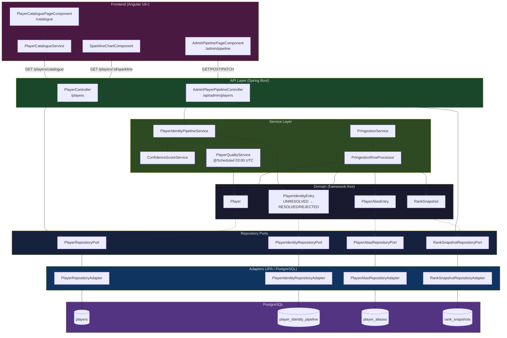

# Player Data Pipeline — Documentation Technique

> Sprint 13 · Paige (Tech Writer) · 2026-03-22
> État documenté : code actuel (pas la cible)

---

## Table des matières

1. [Vue d'ensemble](#1-vue-densemble)
2. [Modèle de données joueur](#2-modèle-de-données-joueur)
3. [Pipeline d'ingestion CSV](#3-pipeline-dingestion-csv)
4. [Résolution d'identité (pipeline admin)](#4-résolution-didentité-pipeline-admin)
5. [Historique des alias](#5-historique-des-alias)
6. [Snapshots de rang (sparklines)](#6-snapshots-de-rang-sparklines)
7. [Schéma de base de données](#7-schéma-de-base-de-données)
8. [Endpoints API](#8-endpoints-api)
9. [Frontend — Catalogue joueurs](#9-frontend--catalogue-joueurs)
10. [Architecture Mermaid](#10-architecture-mermaid)

---

## 1. Vue d'ensemble

Le pipeline joueur gère le cycle de vie complet des données Fortnite :

```
CSV source PR (classements)
    → Ingestion (PrIngestionService)
    → Création/mise à jour du joueur (PlayerRepositoryPort)
    → Snapshot de rang quotidien (RankSnapshot)
    → Queue de résolution d'identité (PlayerIdentityEntry)
    → Résolution admin (PlayerIdentityPipelineService)
    → Historisation des alias (PlayerAliasEntry)
    → Catalogue frontend (PlayerController /catalogue)
```

La base de données de démonstration contient **25 joueurs** (seed V1002). Le pipeline de production est conçu pour ingérer des centaines de joueurs par saison via CSV.

---

## 2. Modèle de données joueur

### 2.1 Domaine (`domain/player/model/Player.java`)

Modèle pur, sans dépendances framework (hexagonal).

| Champ | Type | Description |
|-------|------|-------------|
| `id` | `UUID` | Identifiant interne |
| `fortniteId` | `String?` | Epic Games account ID — nullable jusqu'à résolution |
| `username` | `String` | Nom de compte brut (CSV source) |
| `nickname` | `String` | Nom d'affichage principal |
| `region` | `PlayerRegion` | Région principale (voir §2.2) |
| `tranche` | `String` | Palier de rang (voir §2.3) |
| `currentSeason` | `int` | Saison de référence (défaut : 2025) |
| `locked` | `boolean` | Verrouillé = non sélectionnable en draft |

**Reconstitution depuis la persistance** : `Player.restore(id, fortniteId, username, nickname, region, tranche, season, locked, ...)`

### 2.2 Régions (`PlayerRegion`)

| Valeur | Description |
|--------|-------------|
| `EU` | Europe |
| `NAW` | North America West |
| `NAC` | North America Central |
| `NA` | North America (générique, legacy) |
| `BR` | Brazil |
| `ASIA` | Asie |
| `OCE` | Océanie |
| `ME` | Middle East |
| `UNKNOWN` | Non résolu |

> **Note** : Le catalogue frontend accepte `EU, NAW, BR, ASIA, OCE, NAC, ME`. La valeur `GLOBAL` n'est PAS valide — le backend lève `IllegalArgumentException` (400) si envoyée.

### 2.3 Tranches de rang

Calculées dans `PrIngestionRowProcessor` à partir du rang CSV :

| Rang dans CSV | Tranche |
|---------------|---------|
| 1 – 5 | `"1-5"` |
| 6 – 10 | `"6-10"` |
| 11 – 30 | `"11-30"` |
| 31+ | `"31-infini"` |

---

## 3. Pipeline d'ingestion CSV

### 3.1 Point d'entrée : `PrIngestionService`

```
ingest(Reader csv, PrIngestionConfig config)
  └─ parse CSV lignes
  └─ PrIngestionRowProcessor.process(row) pour chaque ligne
       ├─ resolvePlayer(row, region, config)  → PlayerRepositoryPort
       ├─ upsertSnapshot(player, region, row) → PrSnapshotRepository (legacy)
       ├─ upsertScore(player, row)            → ScoreRepositoryPort
       ├─ queueIdentityEntry(player)          → PlayerIdentityRepositoryPort
       └─ historizeAlias(player)              → PlayerAliasRepositoryPort
```

### 3.2 Configuration (`PrIngestionConfig`)

| Paramètre | Défaut | Description |
|-----------|--------|-------------|
| `source` | `"LOCAL_PR_CSV"` | Étiquette d'origine |
| `season` | `2025` | Numéro de saison |
| `writeScores` | `false` | Calcule les scores d'équipe durant l'ingestion |

### 3.3 Job qualité quotidien (`PlayerQualityService`)

Planifié à **03:00 UTC** (`@Scheduled(cron = "0 0 3 * * *")`).

| FR | Action |
|----|--------|
| FR-07 | Calcule la région principale de chaque joueur (historique 12 mois) et met à jour `player.region` |
| FR-08 | Détecte les Epic IDs dupliqués entre joueurs (alerte log) |
| FR-09 | Signale les entrées UNRESOLVED de plus de 24h pour intervention manuelle |

---

## 4. Résolution d'identité (pipeline admin)

### 4.1 Domaine (`domain/player/identity/model/PlayerIdentityEntry.java`)

Une entrée par joueur dans la table `player_identity_pipeline`.

| Champ | Type | Description |
|-------|------|-------------|
| `id` | `UUID` | ID de l'entrée |
| `playerId` | `UUID` | Référence joueur |
| `playerUsername` | `String` | Username capturé à la création |
| `playerRegion` | `String` | Région capturée à la création |
| `epicId` | `String?` | Epic Games ID résolu (nullable) |
| `status` | `IdentityStatus` | UNRESOLVED / RESOLVED / REJECTED |
| `confidenceScore` | `int` | Score heuristique 0–100 |
| `resolvedBy/At` | `String/Timestamp` | Audit de résolution |
| `rejectionReason/At` | `String/Timestamp` | Audit de rejet |
| `createdAt` | `Timestamp` | Date d'entrée dans la queue |

**Corrections métadonnées** (`MetadataCorrection` VO) :

| Champ | Description |
|-------|-------------|
| `correctedUsername` | Username corrigé par admin |
| `correctedRegion` | Région corrigée par admin |
| `correctedBy/At` | Audit de la correction |

### 4.2 Cycle de vie des statuts

```
[INGESTION CSV]
      │
      ▼
 UNRESOLVED  ──→  resolve(epicId, score, by)  ──→  RESOLVED
      │
      └──────→  reject(reason, by)  ──────────→  REJECTED
```

Les transitions sont à **sens unique** — un RESOLVED ou REJECTED ne revient pas en UNRESOLVED.

### 4.3 Score de confiance (`ConfidenceScoreService`)

| Condition | Points |
|-----------|--------|
| Base | 30 |
| Username exact match (normalisé) | +50 → **80** |
| Username partial match | +25 → **55** |
| Score maximal | **100** |

La normalisation supprime les caractères non-alphanumériques et met en minuscule.

### 4.4 Statistiques régionales

`findLastIngestedAtByRegion()` et `countByRegionAndStatus()` permettent à l'admin de voir l'état de chaque région dans l'onglet "Statut par région" du panneau admin.

---

## 5. Historique des alias

Table `player_aliases` — append-only (jamais de DELETE).

| Champ | Description |
|-------|-------------|
| `playerId` | Référence joueur |
| `nickname` | Alias historisé |
| `source` | Origine : `FORTNITE_API`, `PR_CSV`, `MANUAL` |
| `current` | `true` pour l'alias actif, `false` pour l'historique |
| `createdAt` | Date d'enregistrement |

**Comportement** : lors de chaque ingestion, si le nickname change, l'ancien alias passe à `current=false` et le nouveau est inséré avec `current=true`.

---

## 6. Snapshots de rang (sparklines)

Table `rank_snapshots` — append-only, contrainte unique `(player_id, region, snapshot_date)`.

| Champ | Description |
|-------|-------------|
| `playerId` | Référence joueur |
| `region` | Région du classement |
| `rank` | Position (1 = meilleur) |
| `prValue` | Points PR associés |
| `snapshotDate` | Date du snapshot (un par jour max) |

### Données de démonstration (V1002)

| Joueur | Région | Progression rang (5 semaines) |
|--------|--------|-------------------------------|
| Bugha_EU | EU | 3 → 2 → 1 → 1 → 1 (PR 18200 → 21050) |
| Aqua_EU | EU | 2 → 3 → 2 → 2 → 2 (PR 17500 → 19100) |
| Clix_NAW | NAW | 5 → 3 → 2 → 1 → 1 (PR 15200 → 18900) |

**Accès frontend** : `GET /players/{id}/sparkline?region=EU&days=14` → utilisé par `SparklineChartComponent` dans le catalogue.

---

## 7. Schéma de base de données

```
players
  ├── id (UUID PK)
  ├── fortnite_id (VARCHAR, nullable, unique)
  ├── username (VARCHAR)
  ├── nickname (VARCHAR, unique)
  ├── region_enum (region_type PostgreSQL)
  ├── tranche (VARCHAR)
  ├── current_season (INT)
  └── locked (BOOLEAN)

player_identity_pipeline  [V35, V41, V44]
  ├── id (UUID PK)
  ├── player_id (UUID FK → players, unique)
  ├── player_username / player_region
  ├── epic_id (nullable)
  ├── status (UNRESOLVED/RESOLVED/REJECTED)
  ├── confidence_score (SMALLINT 0–100)
  ├── resolved_by / resolved_at
  ├── rejection_reason / rejected_at
  ├── corrected_username / corrected_region / corrected_by / corrected_at
  └── created_at
  Indexes: idx_player_identity_status, idx_player_identity_player_id

player_aliases  [V29]
  ├── alias_id (UUID PK)
  ├── player_id (UUID FK → players)
  ├── nickname (VARCHAR)
  ├── source (VARCHAR)
  ├── current (BOOLEAN)
  └── created_at
  Indexes: idx_player_aliases_player_id, idx_player_aliases_player_current

rank_snapshots  [V45]
  ├── id (UUID PK)
  ├── player_id (UUID FK → players)
  ├── region (VARCHAR)
  ├── rank (INT)
  ├── pr_value (INT)
  └── snapshot_date (DATE)
  Unique: (player_id, region, snapshot_date)
  Index: idx_rank_snapshots_player_region_date DESC
```

---

## 8. Endpoints API

### Public (`PlayerController`)

| Méthode | Endpoint | Description |
|---------|----------|-------------|
| `GET` | `/players` | Liste paginée (max 50) |
| `GET` | `/players/{id}` | Détail d'un joueur |
| `GET` | `/players/{id}/sparkline` | Snapshots de rang (params: region, days) |
| `GET` | `/players/catalogue` | Catalogue avec filtres (region, tranche, available) |
| `GET` | `/players/catalogue/search` | Recherche full-text |

### Admin (`AdminPlayerPipelineController` — `/api/admin/players`)

| Méthode | Endpoint | Description |
|---------|----------|-------------|
| `GET` | `/unresolved` | Entrées UNRESOLVED paginées |
| `GET` | `/resolved` | Entrées RESOLVED paginées |
| `GET` | `/pipeline/count` | Compteurs par statut |
| `GET` | `/pipeline/regional-status` | Stats par région |
| `POST` | `/resolve` | Résoudre : `{ playerId, epicId }` |
| `POST` | `/reject` | Rejeter : `{ playerId, reason }` |
| `PATCH` | `/{playerId}/metadata` | Corriger : `{ username?, region? }` |

---

## 9. Frontend — Catalogue joueurs

**Route** : `/catalogue` (pas de guard, accessible sans connexion)

### Interface TypeScript

```typescript
interface AvailablePlayer {
  id: string;
  username: string;
  nickname: string;
  region: string;       // "EU", "NAW", etc.
  tranche: string;      // "1-5", "6-10", "11-30", "31-infini"
  available: boolean;   // !locked
  currentSeason: number;
}

interface RankSnapshot {
  rank: number;
  prValue: number;
  snapshotDate: string;
  region: string;
}
```

### `PlayerCatalogueService`

| Méthode | Description |
|---------|-------------|
| `getPlayers(params)` | Appelle `/catalogue` ou `/catalogue/search` selon la présence d'un terme de recherche. Propagation d'erreur vers le composant (pas de `catchError` silencieux) |
| `getSparkline(playerId, region?, days?)` | Appelle `/players/{id}/sparkline`, alimente `SparklineChartComponent` |

### Gestion des erreurs (BUG-08)

Depuis sprint13, les erreurs backend (ex: 400 région invalide) sont propagées jusqu'au composant et affichées via un bloc `loadError` avec bouton "Réessayer". L'ancienne stratégie de silence (`catchError(() => of([]))`) a été retirée du service.

---

## 10. Architecture Mermaid



---

## Migrations Flyway pertinentes

| Version | Description |
|---------|-------------|
| V1 | Création table `players` (base) |
| V22 | Table `pr_snapshots` (legacy ingestion) |
| V29 | Table `player_aliases` (historisation) |
| V35 | Table `player_identity_pipeline` (résolution) |
| V41 | Colonnes correction métadonnées (`corrected_*`) |
| V44 | Fix type `confidence_score` → SMALLINT |
| V45 | Table `rank_snapshots` (sparkline, append-only) |
| V1002 | Seed démo : 25 joueurs EU/NAW/NAC, 3 games, 15 snapshots |
